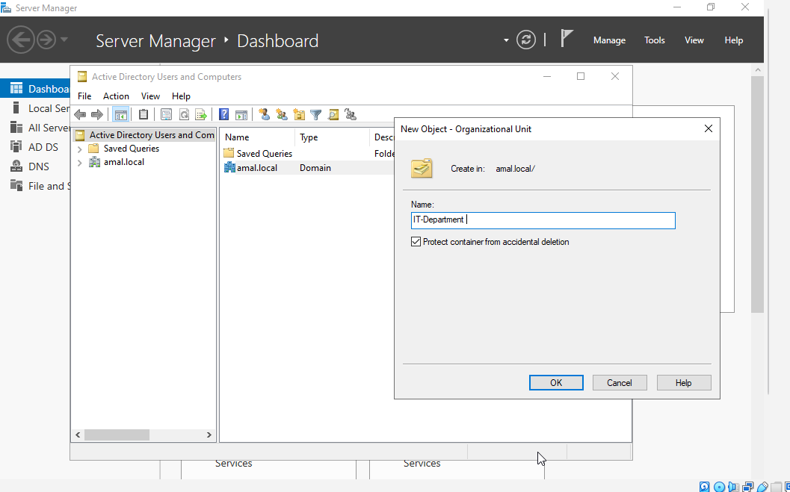
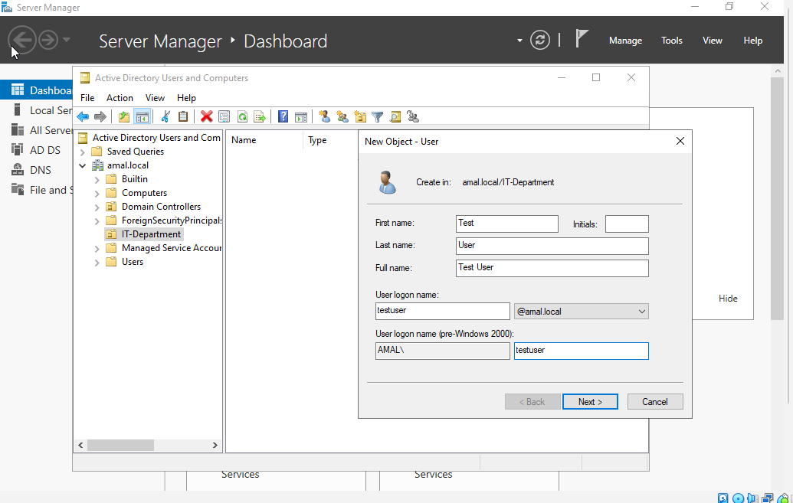
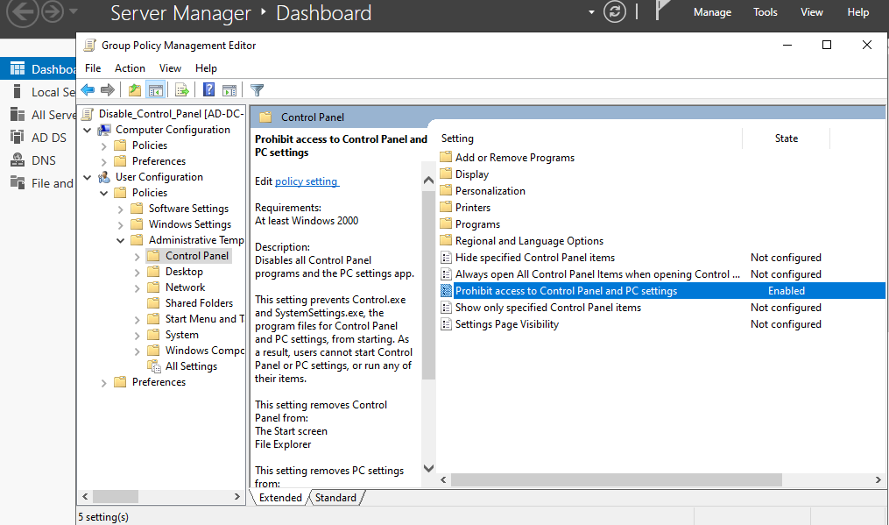
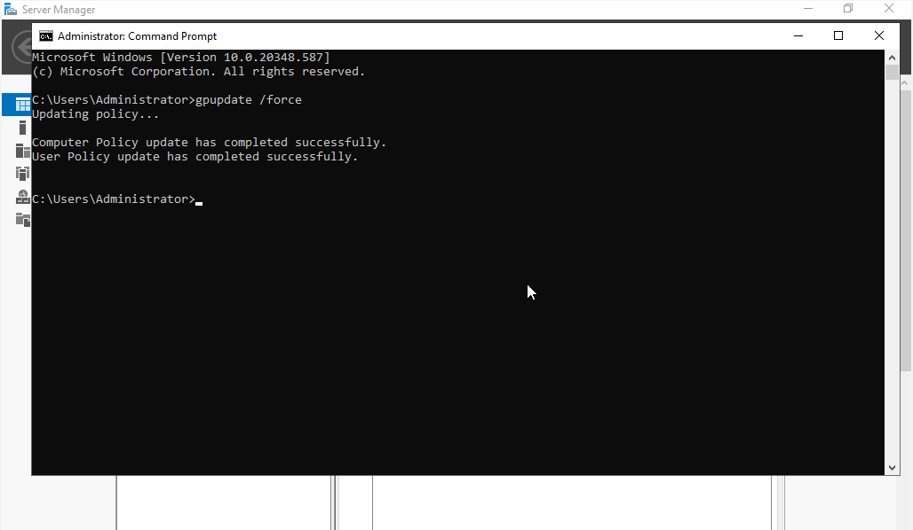

# Windows Server 2022: Active Directory & Group Policy Lab 🛡️

### 🎯 Project Overview
This project demonstrates the deployment of a **Windows Server 2022** environment, focusing on **Active Directory Domain Services (AD DS)** and the practical application of **Group Policy Objects (GPO)** for centralized security management.

---

### 🛠️ Step-by-Step Implementation

#### 1. Domain Controller Setup & Management
* Successfully configured the domain **`amal.local`** and accessed the Server Manager as the Domain Administrator.
* **Screenshot Reference:** `AD-1` (Login/Server Dashboard)

#### 2. Organizational Unit (OU) & User Provisioning
* Created a dedicated Organizational Unit (OU) named **`AmalCreation`** to manage specific departmental users.
* Provisioned user accounts for **Aanya Basnayake** and **Kithnuli Thineja** within the new OU.
* **Screenshot Reference:** `AD-6` to `AD-8` (Users and Computers)

#### 3. Security Policy Configuration (GPO)
* Developed a Group Policy Object (GPO) named **`Disable_Control_Panel`** to enhance system security.
* Configured the policy to restrict access to the Control Panel and PC Settings for all users within the `AmalCreation` OU.
* **Screenshot Reference:** `AD-3` to `AD-5` (GPO Editor & Linking)

#### 4. Policy Enforcement & Testing
* Executed the `gpupdate /force` command to ensure immediate policy propagation across the domain.
* Configured "Allow log on locally" rights to enable standard user testing on the server.
* **Screenshot Reference:** `AD-11` to `AD-15` (Force Update & Local Logon Policy)

#### 5. Final Verification (Results)
* Logged in as a standard user and verified that the GPO successfully blocked access to the Control Panel and Windows Settings.
* **Screenshot Reference:** `AD-16` (Proof of Restrictions)

---

### 📊 Proof of Work

| Step | Description | Screenshot |
| :--- | :--- | :--- |
| **Setup** | Domain Dashboard |  |
| **AD DS** | Users & OU |  |
| **GPO** | Policy Linking |  |
| **Success** | Control Panel Blocked |  |
